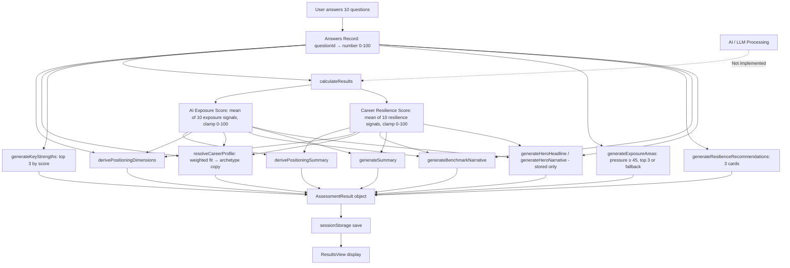

# ILONAA Current Assessment Model

This document describes the ILONAA assessment implementation **exactly as it exists in the codebase** at the time of writing. Source files: `src/lib/assessment/questions.ts`, `scoring.ts`, `positioning.ts`, `profile.ts`, `types.ts`, `src/components/assessment/AssessmentFlow.tsx`, `QuestionInput.tsx`, `QuestionScreen.tsx`, `ResultsView.tsx`.

---

## 1. Assessment Questions (User-Facing Wording)

Questions are shown in this fixed order (`QUESTIONS` array). Each question screen displays `question.text` as the primary heading (`h1`) and `question.subtitle` as supporting copy when present.

### Question 1 — `repetitive-tasks`
- **Type:** slider (5 steps)
- **Text:** How repetitive are your daily tasks?
- **Subtitle:** Think about how predictable your typical work routines feel.
- **Slider labels:** Min: `Varied & dynamic` · Max: `Highly repetitive`

### Question 2 — `human-interaction`
- **Type:** cards
- **Text:** How much human interaction does your work require?
- **Subtitle:** Consider conversations, collaboration, and interpersonal nuance.

### Question 3 — `creativity`
- **Type:** slider (5 steps)
- **Text:** How important is creativity in your role?
- **Subtitle:** Original thinking, ideation, and novel approaches.
- **Slider labels:** Min: `Not important` · Max: `Critically important`

### Question 4 — `strategic-decision`
- **Type:** buttons
- **Text:** How much strategic decision-making is involved?
- **Subtitle:** Long-term thinking, trade-offs, and direction-setting.

### Question 5 — `specialized-expertise`
- **Type:** cards
- **Text:** How dependent is your work on specialized expertise?
- **Subtitle:** Depth of knowledge that takes time to develop.

### Question 6 — `ai-capable-today`
- **Type:** buttons
- **Text:** Could AI already perform parts of your work today?
- **Subtitle:** Be honest about what tools could assist or replace tasks now.

### Question 7 — `trust-relationships`
- **Type:** slider (5 steps)
- **Text:** How important is trust and relationship-building in your role?
- **Subtitle:** Credibility, empathy, and sustained human connection.
- **Slider labels:** Min: `Not important` · Max: `Essential`

### Question 8 — `industry-change`
- **Type:** cards
- **Text:** How quickly is AI changing your industry?
- **Subtitle:** The pace of transformation around you.

### Question 9 — `adaptability`
- **Type:** buttons
- **Text:** How adaptable are you to learning new tools?
- **Subtitle:** Your openness to evolving how you work.

### Question 10 — `personal-judgment`
- **Type:** slider (5 steps)
- **Text:** How much personal judgment is required in your work?
- **Subtitle:** Context, nuance, and decisions only you can make.
- **Slider labels:** Min: `Very little` · Max: `A great deal`

---

## 2. Answer Options by Question

### Slider questions (`repetitive-tasks`, `creativity`, `trust-relationships`, `personal-judgment`)

Sliders use **5 steps** (`sliderSteps: 5`). The UI shows step positions 1–5 on a range input. Stored values are converted to a 0–100 scale via `sliderValueFromStep(step, steps)`:

```
value = round(((step - 1) / (steps - 1)) * 100)
```

| Step | Stored value (0–100) |
|------|----------------------|
| 1    | 0                    |
| 2    | 25                   |
| 3    | 50                   |
| 4    | 75                   |
| 5    | 100                  |

**Default on first render (slider only):** When a slider question is shown and the user has not answered yet, `AssessmentFlow` auto-sets the answer to step `ceil(sliderSteps / 2)` → step **3** → value **50**.

**Display:** The slider UI also shows the numeric value as `X / 100`.

---

### Question 2 — `human-interaction` (cards)

| Label        | Description                              | Value |
|--------------|------------------------------------------|-------|
| Minimal      | Mostly independent or async work         | 20    |
| Moderate     | Regular touchpoints with others          | 45    |
| Significant  | Collaboration is central to outcomes     | 70    |
| Essential    | Relationships drive the work             | 95    |

---

### Question 4 — `strategic-decision` (buttons)

| Label      | Value |
|------------|-------|
| Rarely     | 20    |
| Sometimes  | 45    |
| Often      | 70    |
| Constantly | 95    |

---

### Question 5 — `specialized-expertise` (cards)

| Label               | Description                         | Value |
|---------------------|-------------------------------------|-------|
| General skills      | Broad, transferable capabilities    | 25    |
| Some specialization | Focused but learnable domain        | 45    |
| Deep expertise      | Years of focused development        | 70    |
| Rare expertise      | Difficult to replicate knowledge    | 95    |

---

### Question 6 — `ai-capable-today` (buttons)

| Label                 | Value |
|-----------------------|-------|
| Not yet               | 15    |
| A few tasks           | 40    |
| Many tasks            | 65    |
| Significant portions  | 85    |

---

### Question 8 — `industry-change` (cards)

| Label                    | Description                      | Value |
|--------------------------|----------------------------------|-------|
| Barely noticeable        | Change is slow or distant        | 15    |
| Gradual shift            | Steady evolution over time       | 40    |
| Noticeable acceleration  | Clear momentum building          | 65    |
| Rapid transformation     | Industry is shifting quickly     | 90    |

---

### Question 9 — `adaptability` (buttons)

| Label                  | Value |
|------------------------|-------|
| Prefer familiar tools  | 25    |
| Open when needed       | 50    |
| Enjoy learning         | 75    |
| Actively seek new tools| 95    |

---

## 3. Answer Storage Format

Answers are stored as `Answers = Record<string, number>` — one numeric value per question `id`.

- **Cards / buttons:** The selected option’s `value` is stored directly.
- **Sliders:** The converted 0–100 value is stored.
- **Missing keys:** Any scoring lookup uses `getAnswer(answers, key, fallback = 50)` → default **50** if absent.

---

## 4. AI / LLM Involvement

**There are no AI or LLM API calls in the assessment or results pipeline.**

- No OpenAI, Anthropic, or other model clients exist in the repository for scoring or narrative generation.
- `calculateResults()` runs entirely in the browser via deterministic TypeScript functions.
- The landing page Process step copy says *“AI analyzes your profession”* and *“Our model evaluates your responses…”* — that is **marketing/UI copy only** (`src/components/sections/Process.tsx`), not implemented backend logic.
- The assessment completion loading message says *“Analyzing your responses…”* (`AssessmentFlow.tsx`) — this is a **500ms delay** before navigation; no analysis service is called.

**There is no prompt sent to any AI model.**

---

## 5. Core Scoring: AI Exposure Score

**Function:** `calculateAiExposureScore(answers)`

**Method:** Arithmetic mean of 10 exposure signals, then `clamp(round(average), 0, 100)`.

| # | Signal | Formula |
|---|--------|---------|
| 1 | Repetitive tasks | `repetitive-tasks` |
| 2 | Low human interaction | `100 - human-interaction` |
| 3 | Low creativity | `100 - creativity` |
| 4 | Low strategic decision | `100 - strategic-decision` |
| 5 | Low specialized expertise | `100 - specialized-expertise` |
| 6 | AI capable today | `ai-capable-today` |
| 7 | Low trust/relationships | `100 - trust-relationships` |
| 8 | Industry change pace | `industry-change` |
| 9 | Low adaptability | `100 - adaptability` |
| 10 | Low personal judgment | `100 - personal-judgment` |

```
aiExposureScore = clamp( round( sum(exposureSignals) / 10 ), 0, 100 )
```

**Interpretation in code:** Higher score = higher exposure (more automation pressure signals).

---

## 6. Core Scoring: Career Resilience Score

**Function:** `calculateCareerResilienceScore(answers)`

**Method:** Arithmetic mean of 10 resilience signals, then `clamp(round(average), 0, 100)`.

| # | Signal | Formula |
|---|--------|---------|
| 1 | Low repetitive tasks | `100 - repetitive-tasks` |
| 2 | Human interaction | `human-interaction` |
| 3 | Creativity | `creativity` |
| 4 | Strategic decision | `strategic-decision` |
| 5 | Specialized expertise | `specialized-expertise` |
| 6 | Low AI capability today | `100 - ai-capable-today` |
| 7 | Trust/relationships | `trust-relationships` |
| 8 | Industry change (damped) | `100 - industry-change * 0.6` |
| 9 | Adaptability | `adaptability` |
| 10 | Personal judgment | `personal-judgment` |

```
careerResilienceScore = clamp( round( sum(resilienceSignals) / 10 ), 0, 100 )
```

**Note:** The industry-change term is the only signal using a **0.6 multiplier** inside the resilience calculation.

---

## 7. Positioning Layer

### 7.1 Positioning summary

**Function:** `derivePositioningSummary(aiExposure, resilience)`

Evaluated in order; first match wins:

| Condition | Output text |
|-----------|-------------|
| `resilience >= 68` AND `aiExposure <= 48` | Well positioned today—human leverage with manageable automation pressure. |
| `resilience >= 60` AND `aiExposure >= 55` | Capable and exposed at once—strength to use, pressure to read honestly. |
| `aiExposure >= 62` | Real exposure in parts of how you work—clarity now prevents drift later. |
| (else) | Your positioning is still forming—a calm map of where you stand, not a verdict. |

### 7.2 Positioning dimensions

**Function:** `derivePositioningDimensions(answers, aiExposure, resilience)`

Returns 6 dimensions:

| id | Label | Value calculation |
|----|-------|-------------------|
| `resilience` | Your career resilience | `careerResilienceScore` (passed in) |
| `exposure` | Your AI exposure pressure | `aiExposureScore` (passed in) |
| `human` | Your human-centered strengths | `round((human-interaction + trust-relationships) / 2)` |
| `strategic` | Your strategic judgment | `round((strategic-decision + personal-judgment) / 2)` |
| `adaptability` | Your adaptability | `adaptability` |
| `creative` | Your creative differentiation | `creativity` |

**Insight text** for each dimension is selected by threshold rules in `capabilityInsight`, `exposureInsight`, and `resilienceInsight` (see `positioning.ts`).

---

## 8. Career Profile (Archetype) Selection

**Function:** `resolveCareerProfile(answers, aiExposure, resilience)`

### 8.1 Context variables

Built from answers (missing → 50):

- `strategic` = `strategic-decision`
- `human` = average(`human-interaction`, `trust-relationships`)
- `creativity` = `creativity`
- `adaptability` = `adaptability`
- `judgment` = `personal-judgment`
- `expertise` = `specialized-expertise`
- `aiExposure`, `resilience` = composite scores above

### 8.2 Fit score formulas (highest wins)

| Archetype ID | Fit formula |
|--------------|-------------|
| `human-centered-strategist` | `human×1.4 + strategic×1.1 + judgment×0.8 + resilience×0.5` |
| `strategic-integrator` | `strategic×1.3 + judgment×1.2 + expertise×0.6 + resilience×0.5` |
| `adaptive-builder` | `adaptability×1.5 + creativity×0.7 + (100−aiExposure)×0.3 + resilience×0.4` |
| `creative-synthesizer` | `creativity×1.4 + judgment×1.0 + adaptability×0.5` |
| `systems-oriented-thinker` | `expertise×1.3 + strategic×0.8 + judgment×0.7` |
| `measured-navigator` | `100 − abs(resilience−55) − abs(aiExposure−50)×0.5` |

Winner = archetype with maximum fit. Tie-breaking: sort descending; first entry after sort wins (object key order in `Object.keys(PROFILES)` before sort is not used for tie-break — equal fits depend on sort stability).

Fallback winner ID if none: `measured-navigator`.

### 8.3 Static copy per archetype

Each archetype has fixed strings: `archetypeTitle`, `archetypeTagline`, `quotableInsight` (base), `profileEssence`, `profileSummary`, `resilienceFraming`, `comparativeContext` — defined in `PROFILES` in `profile.ts`.

### 8.4 Quotable insight alternates

**Function:** `resolveQuotableInsight(winnerId, ctx)`

If an entry in `QUOTABLE_ALTERNATES[winnerId]` has `when(ctx) === true`, use that `line`; otherwise use base `quotableInsight`.

| Archetype | Alternate condition | Alternate line |
|-----------|---------------------|----------------|
| human-centered-strategist | `resilience >= 70` AND `aiExposure <= 45` | You remain strongest where trust still outperforms prediction. |
| strategic-integrator | `judgment >= 68` | Your value increases where context resists automation. |
| adaptive-builder | `aiExposure >= 58` | You operate where tools accelerate work—but judgment still sets direction. |
| creative-synthesizer | `creativity >= 72` | Your advantage grows where ambiguity still needs interpretation. |
| systems-oriented-thinker | `expertise >= 68` | You remain strongest where judgment still matters more than output. |
| measured-navigator | `resilience >= 62` AND `aiExposure >= 55` | You hold ground where capability and exposure meet at once. |

---

## 9. Narrative Generation (Rule-Based)

All narratives are **template branches** on numeric thresholds — no generative AI.

### 9.1 `heroHeadline` / `heroNarrative`

Computed in `scoring.ts` and stored on `AssessmentResult`.

**Not displayed** in `ResultsView.tsx` (no UI references to these fields).

#### `generateHeroHeadline` (first match)

| Condition | Text |
|-----------|------|
| `resilience >= 70` AND `human >= 65` | Your profile suggests strong resilience in strategic and relationship-driven environments. |
| `resilience >= 70` AND `strategic >= 65` | Your profile reflects thoughtful strength in complexity, judgment, and long-range thinking. |
| `resilience >= 55` AND `aiExposure <= 50` | Your profile suggests a balanced foundation with room to deepen your most human advantages. |
| `aiExposure >= 60` AND `resilience >= 55` | Your profile sits at an active intersection of change and capability — a thoughtful place to begin. |
| else | Your profile reveals a clear starting point for building clarity and intentional career direction. |

#### `generateHeroNarrative` (first match)

| Condition | Text |
|-----------|------|
| `resilience >= 70` | Your responses point to durable professional qualities — the kind that tend to compound over time rather than fade with technological shifts. |
| `adaptability >= 65` AND `expertise >= 55` | You combine developing depth with openness to change — a pairing that often translates well as industries evolve. |
| `aiExposure >= 60` | Some aspects of your work may face increasing automation pressure, but this is context for planning — not a verdict on your future. |
| else | These patterns are meant to inform your thinking with calm precision — offering direction without reducing your career to a single score. |

### 9.2 Key strengths (top 3)

**Function:** `generateKeyStrengths`

Six candidates with internal `score`; sorted descending; top **3** returned (title + description only).

| Title | Score used |
|-------|------------|
| Strategic Thinking | `strategic-decision` |
| Human-Centered Skills | avg(`human-interaction`, `trust-relationships`) |
| Adaptability | `adaptability` |
| Contextual Judgment | `personal-judgment` |
| Creative Problem-Solving | `creativity` |
| Specialized Expertise | `specialized-expertise` |

### 9.3 Exposure areas (up to 3)

**Function:** `generateExposureAreas`

Five candidates with `pressure` score:

| Title | pressure formula |
|-------|------------------|
| Routine Task Patterns | `repetitive-tasks` |
| Partial Task Automation | `ai-capable-today` |
| Industry Transformation Pace | `industry-change` |
| Limited Creative Differentiation | `100 - creativity` |
| Reduced Interpersonal Dependency | `100 - human-interaction` |

Filter: `pressure >= 45`, sort descending, take top 3.

**If fewer than 2 qualify**, return fixed fallback pair:
- Moderate Structural Shift
- Tool-Assisted Workflows

(with fixed descriptions in `scoring.ts`).

### 9.4 Resilience recommendations (exactly 3)

**Function:** `generateResilienceRecommendations`

Builds array in order:

1. **Interdisciplinary Thinking** — added if `strategic-decision < 65` OR `aiExposure >= 55`
2. **Strategic Communication** — always added; description branch:
   - if `human-interaction < 65`: translate complexity variant
   - else: articulate judgment variant
3. **AI-Assisted Decision Making** — always added; description branch:
   - if `adaptability < 60`: practice directing tools variant
   - else: pair adaptability variant
4. **Complex Problem-Solving** — added only if `recommendations.length < 3` after above

Return `recommendations.slice(0, 3)` (first three items in build order).

### 9.5 Benchmark narrative

**Function:** `generateBenchmarkNarrative` (first match)

| Condition | Text |
|-----------|------|
| `resilience >= 70` AND `human >= 60` (human = avg interaction + trust) | In transformation, empathy and judgment may carry more weight than speed alone. |
| `resilience >= 60` AND `aiExposure <= 55` | You can navigate industry shifts with measured confidence—aware of change, not defined by it. |
| `adaptability >= 65` | When learning curves steepen, you may turn uncertainty into momentum—not anxiety. |
| else | Small, consistent skill choices may compound into lasting resilience. |

### 9.6 Closing summary

**Function:** `generateSummary(aiExposure, resilience)` (first match)

| Condition | Text |
|-----------|------|
| `resilience >= 70` AND `aiExposure <= 45` | Well balanced today—protect what makes your work distinctly yours. |
| `resilience >= 70` | Resilience is a genuine asset here. Deliberate learning can carry you forward with confidence. |
| `aiExposure >= 65` AND `resilience < 55` | Change is present in how you work—a prompt, not an alarm. Adaptability can shift your trajectory. |
| else | Where you stand today is the start of intentional growth—a calm guide for what comes next. |

---

## 10. Complete `AssessmentResult` Object

**Function:** `calculateResults(answers)` returns:

```typescript
{
  aiExposureScore: number,
  careerResilienceScore: number,
  profile: CareerProfile,           // archetype + copy fields
  positioningSummary: string,
  positioningDimensions: PositioningDimension[],
  heroHeadline: string,             // computed, not shown in results UI
  heroNarrative: string,            // computed, not shown in results UI
  keyStrengths: NarrativeCard[],    // max 3
  exposureAreas: NarrativeCard[],   // 2 or 3
  resilienceRecommendations: NarrativeCard[], // 3
  benchmarkNarrative: string,
  summary: string,
  answers: Answers,
  completedAt: ISO8601 string
}
```

**Persistence:** `sessionStorage` key `ilonaa-assessment-results` via `saveResults()`.

**Reload:** `loadResults()` parses JSON; if `answers` missing → null. If cached result lacks `profile.archetypeTitle`, `positioningDimensions`, or `profile.quotableInsight` → full recalculation via `calculateResults(parsed.answers)`.

---

## 11. Step-by-Step: User Answer → Final Result

1. User opens `/assessment`. `AssessmentFlow` loads `QUESTIONS` (10 items, fixed order).
2. For each question, user selects cards/buttons or adjusts slider. Value stored in React state `answers[questionId]`.
3. Slider questions auto-initialize to **50** on first mount if unanswered.
4. User clicks **Continue**. Analytics records `question_completed` with metadata (`slider_value` or `selected_option` / `selected_option_index`) — does not affect scoring.
5. On question 10, **View Results** triggers:
   - `finalAnswers` = current answers including last question value
   - `result = calculateResults(finalAnswers)` (all logic client-side)
   - Analytics `assessment_completed` with exposure + resilience scores
   - `saveResults(result)` → sessionStorage
   - 500ms loading state, then `router.push("/assessment/results")`
6. Results page calls `loadResults()`. If missing → redirect to `/assessment`.
7. After 600ms delay, UI renders sections from stored `AssessmentResult` (profile, positioning, narratives, cards, etc.).

---

## 12. Flowchart



---

## 13. Results UI Mapping (What Users See)

| Result field | UI section |
|--------------|------------|
| `profile.*` (except comparative in hero) | `ResultsHero` |
| `profile.comparativeContext` | `ComparativeInsight` |
| `positioningSummary`, `positioningDimensions`, scores | `PositioningOverview` |
| `keyStrengths` | NarrativeCardsSection — “Where you are strongest today” |
| `exposureAreas` | NarrativeCardsSection — “Where AI pressure may show up for you” |
| `resilienceRecommendations` | NarrativeCardsSection — “What to strengthen next” |
| `benchmarkNarrative` | `BenchmarkNarrative` |
| `summary` | `ResultsClosing` |
| `heroHeadline`, `heroNarrative` | *(not rendered)* |

---

## 14. Embedded Assumptions in the Current Model

1. **Ten questions** are sufficient and always asked in the fixed order defined in `QUESTIONS`.
2. **All dimensions are comparable on a 0–100 scale**, whether from discrete options or slider conversion.
3. **Missing answers default to 50** (neutral midpoint) in all scoring and profile logic.
4. **AI exposure and career resilience** are independent composite scores derived from the same 10 inputs with inverted or direct polarity — not validated against external labor data.
5. **Equal weighting** (simple arithmetic mean) across all 10 signals in each composite score, except resilience’s `industry-change` term uses `× 0.6` inside `100 - industry-change * 0.6`.
6. **Higher `aiExposureScore` means higher exposure**; **higher `careerResilienceScore` means higher resilience**.
7. **`ai-capable-today` and `industry-change` contribute positively to exposure** and (inversely) to resilience as implemented.
8. **Archetype selection is purely weighted linear fit**, not probabilistic; one winner takes all static copy.
9. **Narrative text is fixed templates** — same thresholds always produce the same strings for a given numeric profile.
10. **“Human” dimension** in profile fit and benchmarks treats `human-interaction` and `trust-relationships` as equally weighted averages.
11. **Strategic judgment dimension** in positioning averages `strategic-decision` and `personal-judgment` equally.
12. **Slider default of 50** may pre-answer slider questions before explicit user interaction.
13. **Exposure area fallback copy** applies whenever fewer than two pressure areas meet `pressure >= 45`, regardless of user profile.
14. **Resilience recommendations** always include Strategic Communication and AI-Assisted Decision Making; order and slice(0,3) can drop Interdisciplinary Thinking if array exceeds three before slice (build order matters).
15. **No personalization beyond numeric thresholds** — two users with identical answer vectors receive identical results.
16. **Results are computed client-side only** — no server-side validation or recomputation on results page load (except full client recalc when cache schema is incomplete).
17. **Marketing copy** (“AI analyzes your profession”) does not reflect runtime behavior.
18. **Analytics events** (Supabase) record engagement and scores but **do not feed back** into result calculation.
19. **Quotable insight alternates** override base insight only when explicit threshold conditions match; first matching alternate in array order wins.
20. **`measured-navigator` fit** rewards proximity to resilience=55 and aiExposure=50 — acts as centroid / default-balanced archetype.

---

## 15. Source File Index

| Concern | File |
|---------|------|
| Question definitions | `src/lib/assessment/questions.ts` |
| Slider value math | `src/lib/assessment/questions.ts` (`sliderValueFromStep`, `stepFromSliderValue`) |
| Composite scores + narratives | `src/lib/assessment/scoring.ts` |
| Positioning copy + dimensions | `src/lib/assessment/positioning.ts` |
| Archetype selection + profile copy | `src/lib/assessment/profile.ts` |
| Types + storage key | `src/lib/assessment/types.ts` |
| Assessment UX flow | `src/components/assessment/AssessmentFlow.tsx` |
| Question rendering | `src/components/assessment/QuestionScreen.tsx`, `QuestionInput.tsx` |
| Results display | `src/components/assessment/ResultsView.tsx`, `results/ResultsSections.tsx` |

---

*End of document.*
